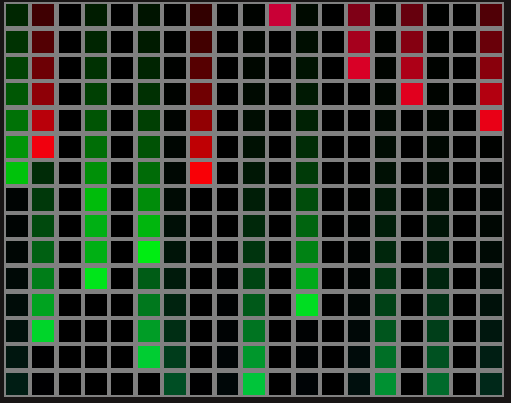
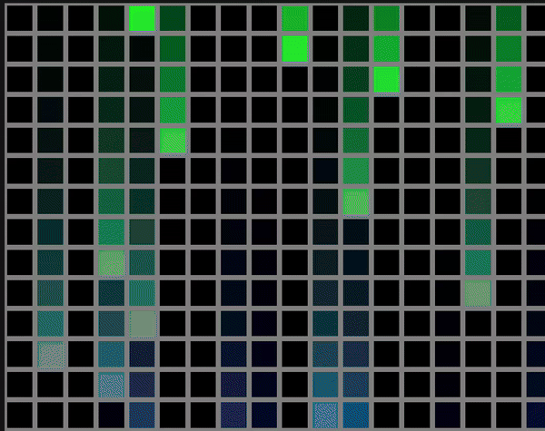

# Final version
## Picture 

## Gif

high level idea is to use div elements to construct 2D grid by using fix height and width div element(or we could use auto sizing od div elements by changing propertys in css )of 20*15 elements.
we would re-render our grid after perticular time interval lets say 225 milliseconds.
we would change color of our grid by changing background color of div element.

Here i have used hex color (ie. #FFFFFF ) to change color.
I have assign and change background-color property of each each div elements.

if we convert each value of RGB color comonents to its decimal and we divide it by constant(greater than 1) say 1.3 then we again calculate hex and combine it we get color that is darker then previous color.
On by doing so to get next color value of pixel above we get closer and closer to darker value and ultimatly black(#000000).
this gives effet that looks like bright star having tail.

Another thing to notice that we can change current frame to next frame by poping last row of 2D matrix and creating new top row in matrix.

While creating new top row we will use random function to pic one value column index and we will impart color to it.
and we will calulate row from previuos row by above mention hex to decimal divid by constant rounding off and again hex then pusing new calucated row.

### How to Change color for new rain pixel?

i have experemented with stratages to change color but after some attemts i fix my algorthen.
i have used one global variable whos value will be in range 0-3*255 and will use only 2 of 3 RGB colors.
i have divided range into 3 portions 0-255 256-510 511-765 and use intrpolation to get two nearby color values.
eg-> 50 => 50 int to hex red color and (255-50) int to hex green color.
and on each itteration we increment global variable value.

## Code Expalination 

declared one globle variable
made one componet name RainFallingAnimation.jsx
then with useState hook inisalize 2d matrix having hex string value.
use map to populate div element on screen with backgaround color from 2D matrix;
then will use useEffect hook to setInterval function, which will call for useState function to update 2D matrix and render new frame.
